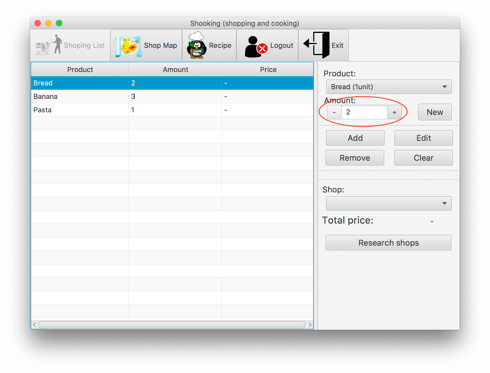
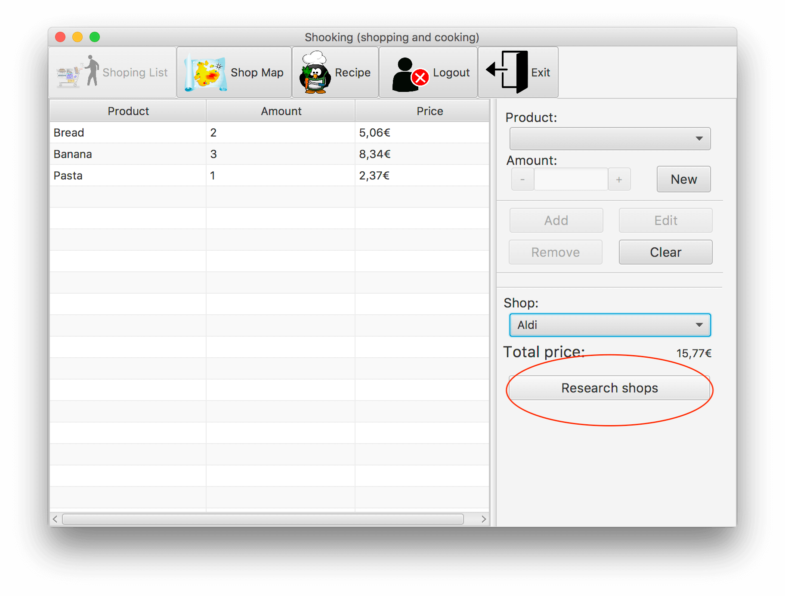
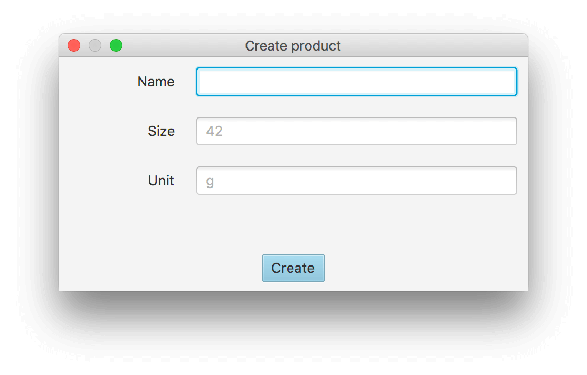
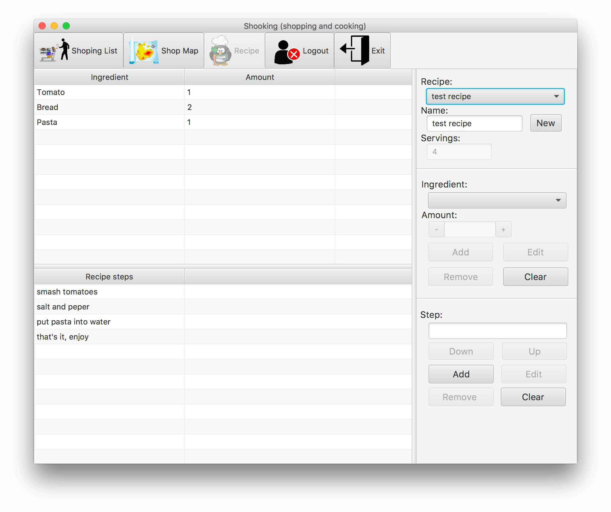
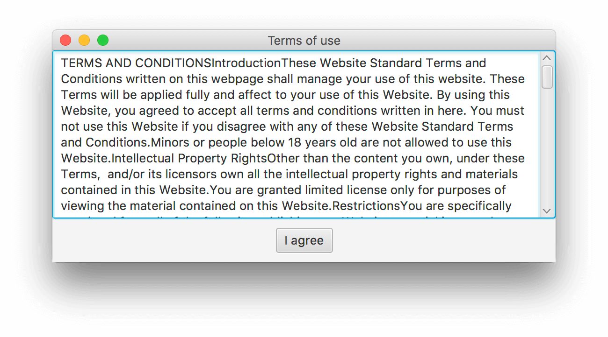
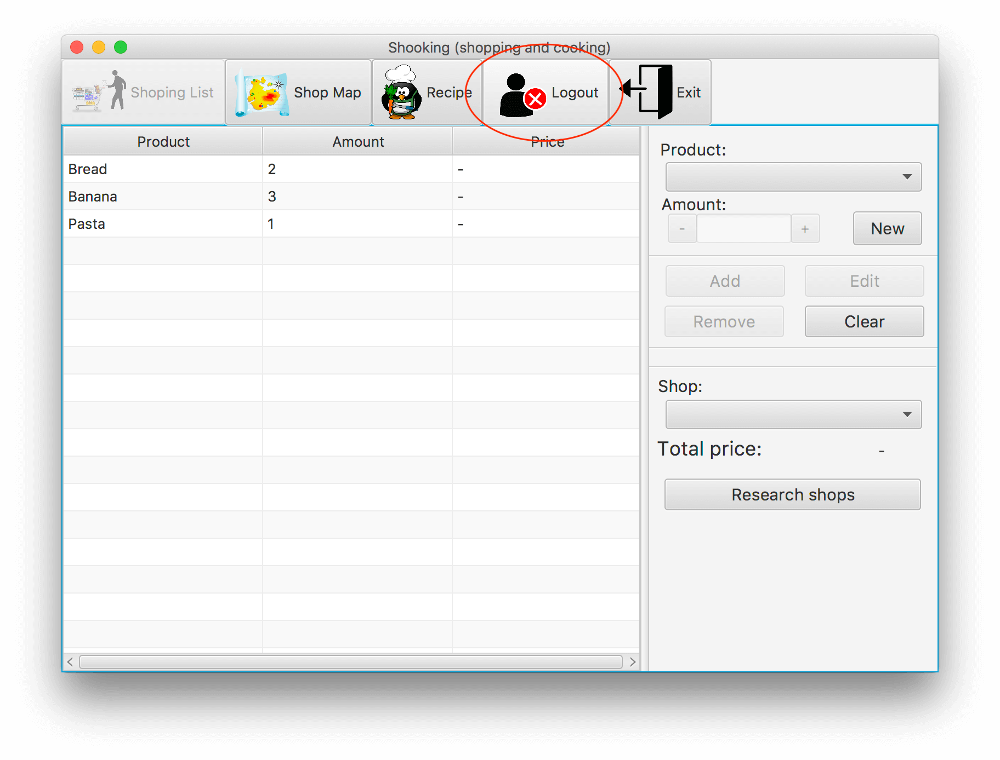
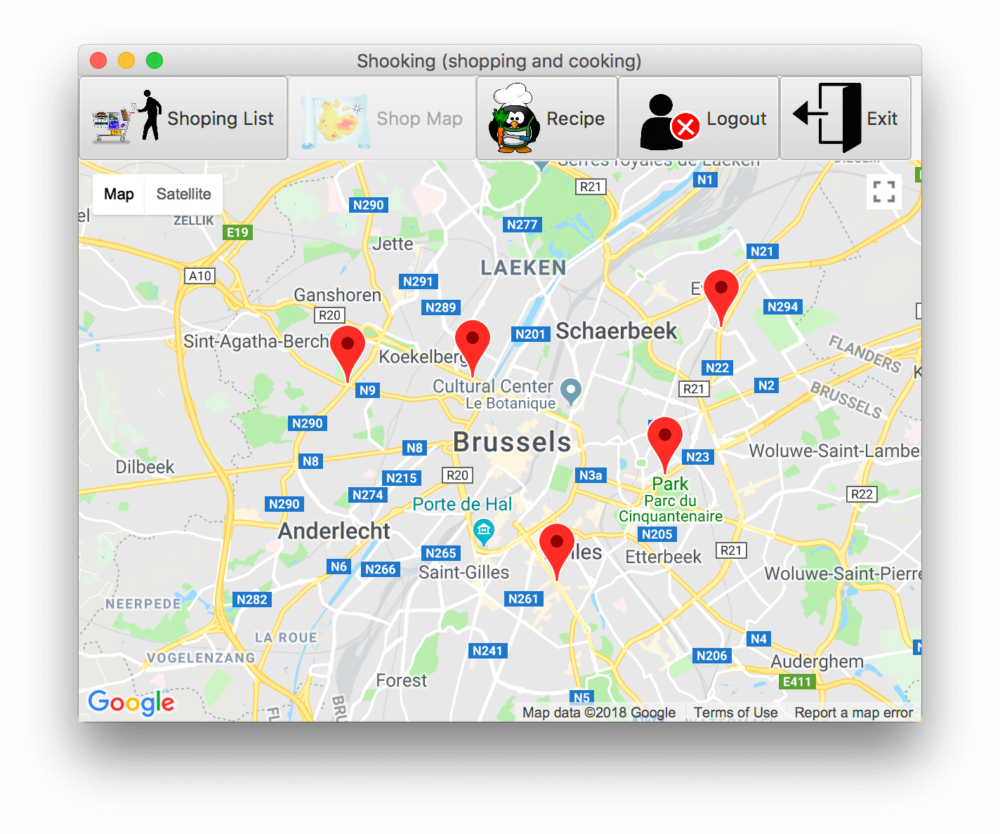
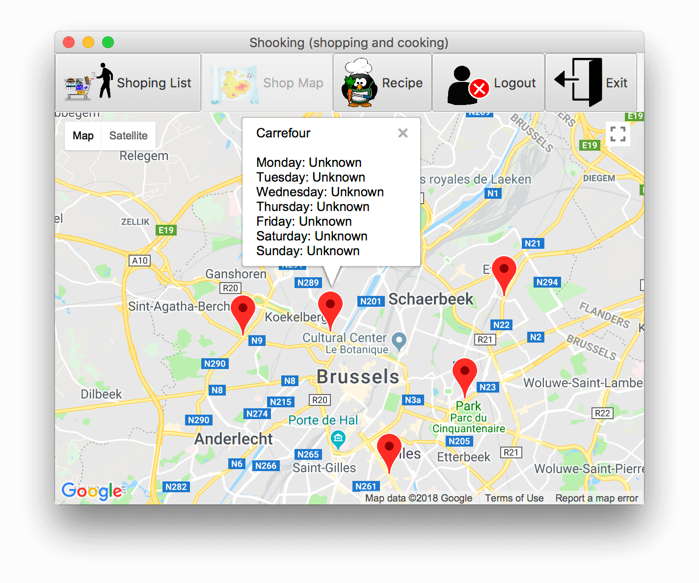
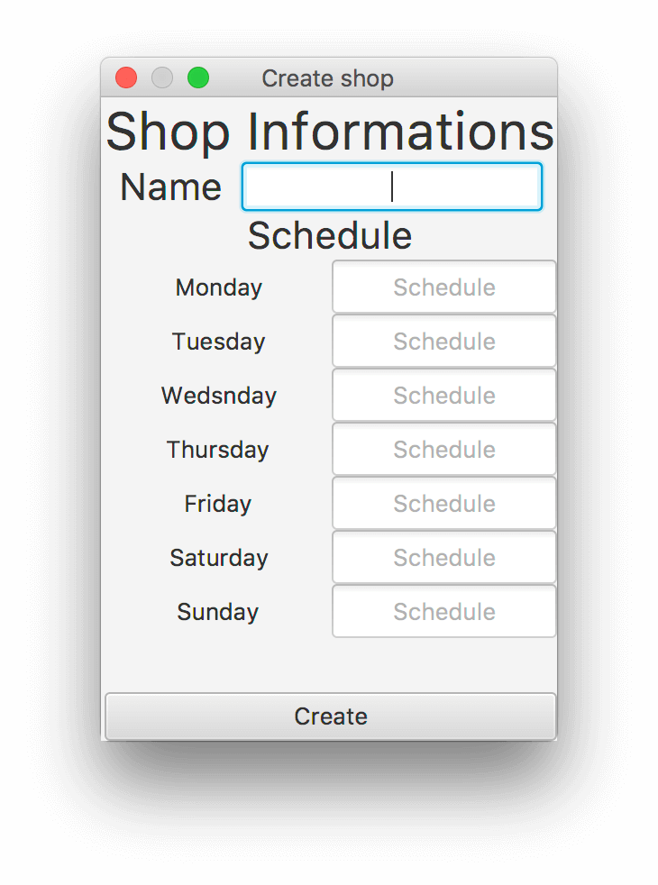

# Utilisation
## Story 1 
- [x] L'utilisateur doit pouvoir créer et modi􏰃er une liste de courses comportant des produits disponibles dans une base de données générique. 

- [x] Pour chaque produit apparaissant dans la liste, il faut pouvoir indiquer le nombre ou la quantité désirée de ce produit. La quantité doit pouvoir être encodée manuellement ou se faire à l'aide de boutons "+" et "-". 

- [x] L'utilisateur doit pouvoir obtenir l'ensemble des magasins dans lesquels un produit de la liste peut être acheté ainsi que le prix du produit, adapté à la quantité souhaitée, dans chaque magasin. L'utilisateur doit également pouvoir obtenir l'ensemble des magasins qui contiennent tous les produits de la liste provenant de la base de donnée, ainsi que le prix total de la liste dans chaque magasin. 

- [x] Si un produit que l'utilisateur souhaite n'apparaît pas dans la base de données, celui-ci doit pouvoir être ajouté à la liste par l'utilisateur.

## Story 3
- [x] Le logiciel doit supporter la création d'une recette. Une recette contient un nom, le nombre de personnes pour laquelle cette dernière est conçue, une liste d'ingrédients (avec la quantité pour chaque ingrédient) ainsi que la séquence d'opérations nécessaires à la réalisation de ladite recette. 

<del> Étant donné une recette, l'utilisateur doit pouvoir générer de manière automatique la liste de courses associée. </del>

<del> De plus, le logiciel doit permettre d'adapter la recette pour un nombre de personne di􏰂érent de celui indiqué dans la recette originale. </del>

## Story 7
- [x] En démarrant le programme, un visiteur peut créer un nouveau compte. 

- [x] Pour ce faire, le visiteur doit tout d'abord accepter les conditions du service dé􏰃nies par l'administrateur du système.

- [x] Par la suite, le visiteur indique ses informations personnelles (par exemple nom d'utilisateur et mot de passe souhaité) et valide. Ces données devront être stockés de manière sécurisé (par example, après chi􏰂rement) dans le système.

- [x] L'interface graphique du programme devra ouv􏰂rir la possibilité de se déconnecter du système à tout moment.

## Story 8
- [x] En démarrant le programme, un visiteur/utilisateur se trouve en face d'une carte faisant référence à une aire urbaine générique. En plus des éléments statiques (bâtiments, routes, parcs, ...), la carte contiendra des épingles pour signaler la présence de magasins. 

- [x] L'utilisateur aura la possibilité de sélectionner ces épingles pour a􏰄cher le nom du magasin ainsi que ses horaires d'ouverture. 

- [x] Le visiteur/utilisateur peut indiquer la présence d'un nouveau magasin à travers la méthode point-and-clic sur la carte. Durant la signalisation d'un magasin, l'utilisateur peut aussi changer les informations qui y sont associés. 

- [x] La fonctionnalité de zoom sur la carte permet d'agrandir ou de restreindre la vue des détails. En particulier, dans le cas du rétrécissement, les épingles plus proches (celles qui se chevauchent) devront être regroupés en une seule épingle en indiquant le nombre d'épingles regroupées. Cela permettra de rendre la carte plus lisible quand la densité des magasins est trop élevée.

